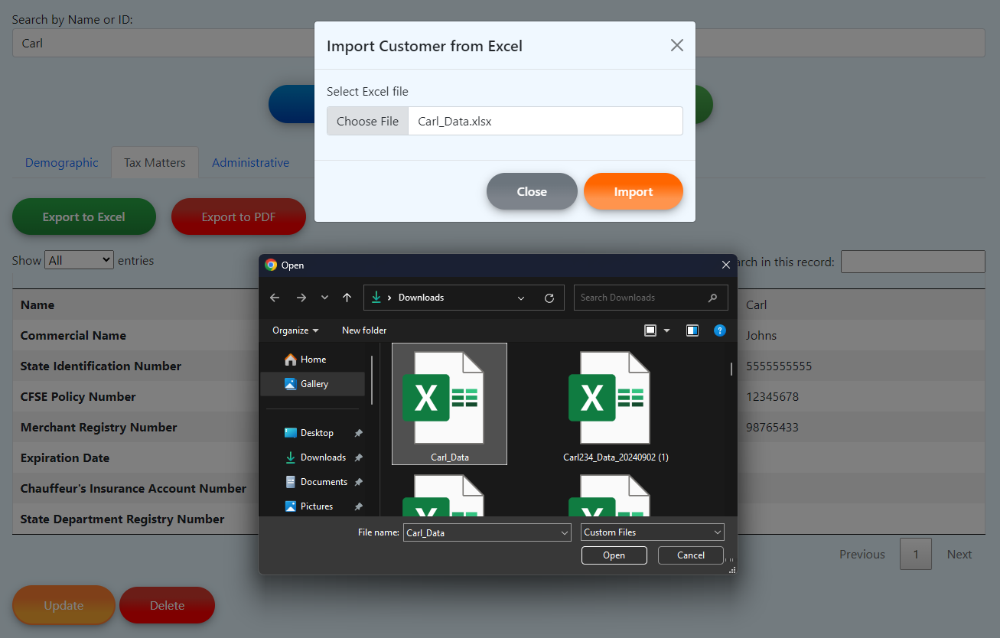

# Client Manager for Accounting

A comprehensive Software as a Service (SaaS) platform for accountants to manage their customers' accounting and tax information efficiently.

## Project Objective

ClientManager offers accountants an efficient platform to manage customer information, simplifying the input, access, and updating of records across various categories like demographics, tax, confidential data, and much more.

## Methods

- Insert Customer's Data:

  
  

  Manual Insert &nbsp;
    Import Insert

- Update Customer's Data:

  
  

  Manual Update &nbsp;
    Import Update

- Export Customer's Data:

  
  

  Export to PDF &nbsp;
    Export to Excel

- Search Customers and Users:

  
  

  Search Customer &nbsp;
    Search User

## Technologies
- `ASP.NET Core 8 MVC`
- `C#`, `Javascript`, `Razor`, `SQL` , `HTML` , `CSS` 
- `Entity Framework`
- `SQL Server Management`

## Architecture and Component Overview

- **Models**: Used for defining data structures for users and customer details.

- **Views**: Razor views are used for rendering the user interface, dynamically presenting data with structured content. The views include dynamic implementations with JavaScript and AJAX, tightly integrated with controllers to ensure responsive and interactive user experiences.

- **Controllers**: The application includes both MVC and API controllers. MVC controllers manage HTTP requests and return views, while API controllers handle RESTful endpoints for external interactions.

- **Business Layer Logic (BLL)**: Implements business rules using interfaces and services. Interfaces ensure loose coupling, and services handle complex operations, providing clean interaction points for controllers.

- **Data Access Layers (DAL)**: Manages database interactions with models, repositories, and migrations. Repositories abstract data access, promoting code reusability and centralized logic.

- **API**: A comprehensive API layer uses controllers and services to expose functionalities to external clients, ensuring scalability and easy integration with other systems.

## Conclusion
ClientManager provides an efficient and user-friendly approach for accountants to manage their customers' data. By automating various aspects of data management and providing a comprehensive set of features, it enhances productivity and ensures accurate record-keeping.

## Contact

- [LinkedIn](https://www.linkedin.com/in/jlopezgonzalez/)
- [GitHub](https://github.com/JLopez662)
- [GitLab](https://gitlab.com/jorge.lopez19)

  
  
  

